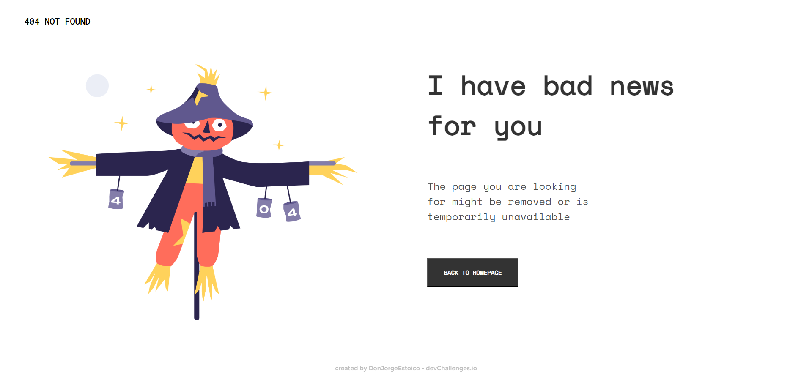

<!-- Please update value in the {}  -->

<h1 align="center">{DevChallenges-404-Page}</h1>

   Solution for a challenge from  <a href="http://devchallenges.io" target="_blank">Devchallenges.io</a>.

  <h3>
    <a href="https://devchallenges-404-page-a5kpftgvg-donjorgeestoicos-projects.vercel.app">
      Demo
    </a>
     | 
    <a href="https://{your-url-to-the-solution}">
      Solution
    </a>
     | 
    <a href="https://legacy.devchallenges.io/challenges/wBunSb7FPrIepJZAg0sY">
      Challenge
    </a>
  </h3>

<!-- TABLE OF CONTENTS -->

## Table of Contents

- [Overview](#overview)
  - [Built With](#built-with)
- [Features](#features)
- [Contact](#contact)
- [Acknowledgements](#acknowledgements)

<!-- OVERVIEW -->

## Overview

- Where can I see your demo? Here <a href="https://devchallenges-404-page-a5kpftgvg-donjorgeestoicos-projects.vercel.app">Demo</a>
- What was your experience? I spent at least 12 hours programming with only pure HTML and CSS languages for this challenge, it was gratifying completing it in less time that I personally thought, some people might done it differently, with more frameworks probably. But in my case I preferally I want it make it with the raw languages for something basic.
- What have you learned/improved? I reviewed the most basic and interesting ways for creating a simple website again, refreshing and practice is the most important thing about programming.
- Your wisdom? Never feel useless or less just because you don't know something easy, medium or hard concepts, or algorithms, you need to practice by learning and mistaking, over and over.

### Built With

<!-- This section should list any major frameworks that you built your project using. Here are a few examples.-->

- [HTML](https://developer.mozilla.org/en-US/docs/Web/HTML)
- [CSS](https://developer.mozilla.org/en-US/docs/Web/CSS)

## Features

<!-- List the features of your application or follow the template. Don't share the figma file here :) -->

This application/site was created as a submission to a [DevChallenges](https://devchallenges.io/challenges) challenge. The [challenge](https://legacy.devchallenges.io/challenges/wBunSb7FPrIepJZAg0sY) was to build an application to complete the given user stories.

## Acknowledgements

<!-- This section should list any articles or add-ons/plugins that helps you to complete the project. This is optional but it will help you in the future. For exmpale -->

- [Steps to replicate a design with only HTML and CSS](https://devchallenges-blogs.web.app/how-to-replicate-design/)
- [Marked - a markdown parser](https://github.com/chjj/marked)
- [HTML Responsive](https://www.w3schools.com/html/html_responsive.asp)
- [CSS Responsive](https://www.w3schools.com/css/css_rwd_intro.asp)

## Contact

- LinkedIn [César Eduardo Aguirre Rubio](https://www.linkedin.com/in/c%C3%A9sar-eduardo-aguirre-rubio-18760720a/)
- GitHub [@DonJorgeEstoico](https://github.com/DonJorgeEstoico)
